# Analog / Digital Sensor Adapter for LEGO EV3 (STM8 Version)
An adapter that allows LEGO EV3 to communicate with analog/digital sensors.
<!--一款能讓 LEGO EV3 與類比/數位感測器通訊的適配器--->

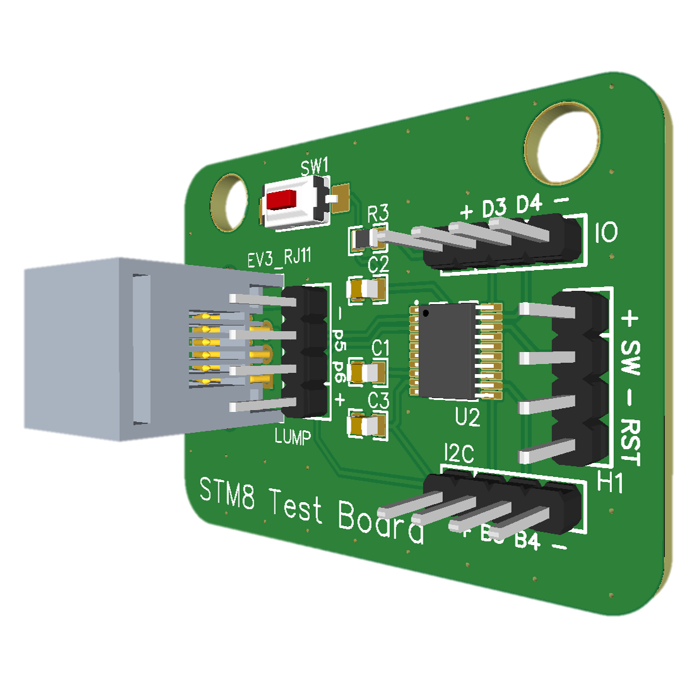

## How it works?
As is well known, typical analog/digital sensors cannot communicate directly with LEGO EV3. Therefore, we use an MCU to convert sensor information into LEGO UART format and then transmit the information to the EV3 host via the **LEGO UART Protocol**.  
<!--眾所周知，一般的類比/數位感測器無法直接與LEGO EV3通訊。因此，我們使用MCU將感測器資訊轉換成LEGO UART格式，再透過LEGO UART協議將資訊傳送至EV3主機。--->

## Wiring

Connect the power supply to the sensor and connect the signal pins of the sensor to pin **D3** of the adapter.
<!--將電源連機到感測器，並將感測器的信號腳位連接到適配器的D3腳位。--->

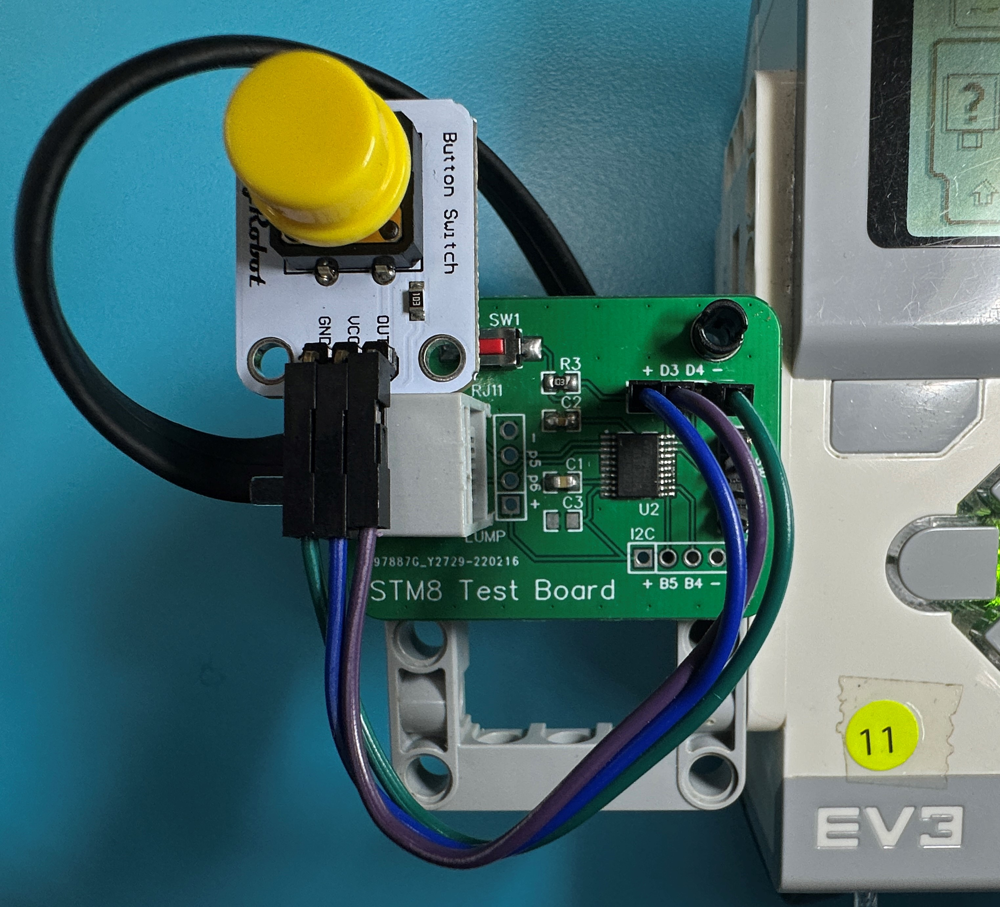

## Solutions

| Button | Magnetic | Tilt |
|:-------:|:-------:|:------:|
|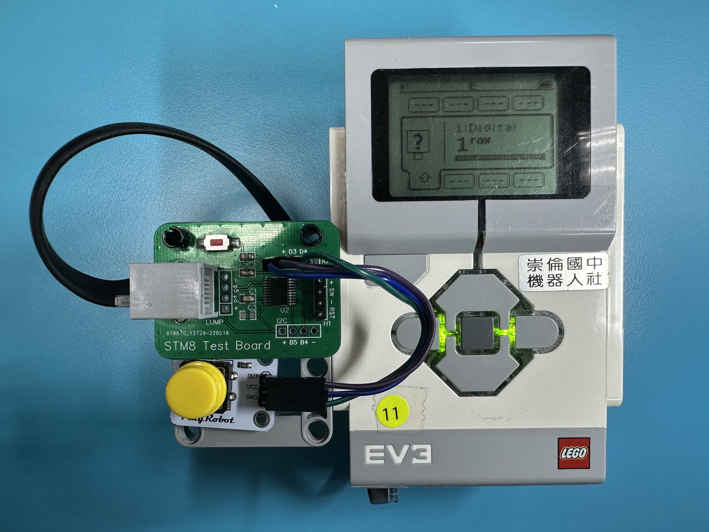||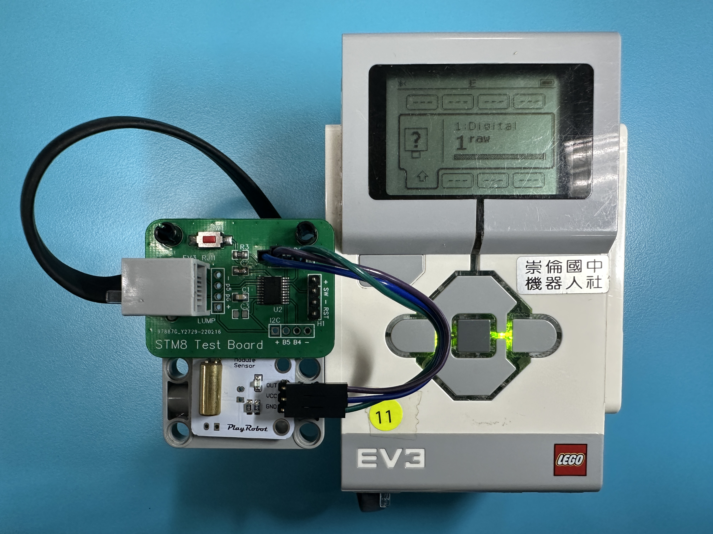|

| Roation | Temperature | Light  |
|:-------:|:-------:|:------:|
|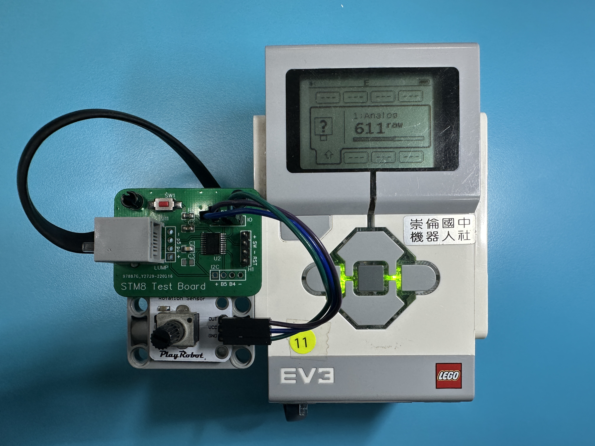|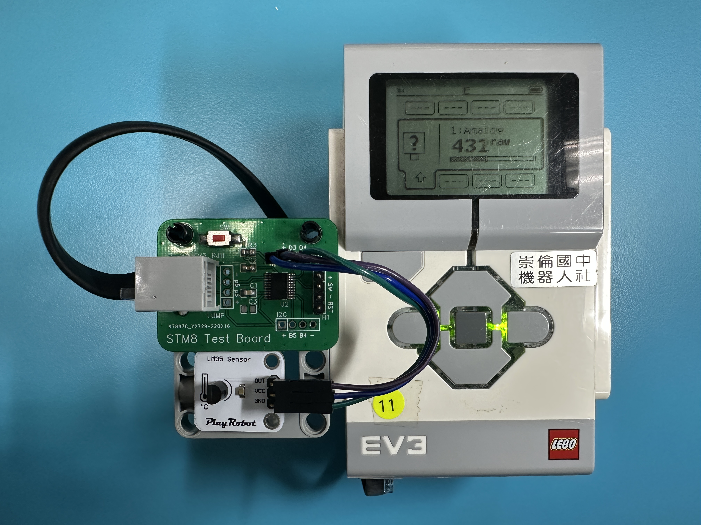|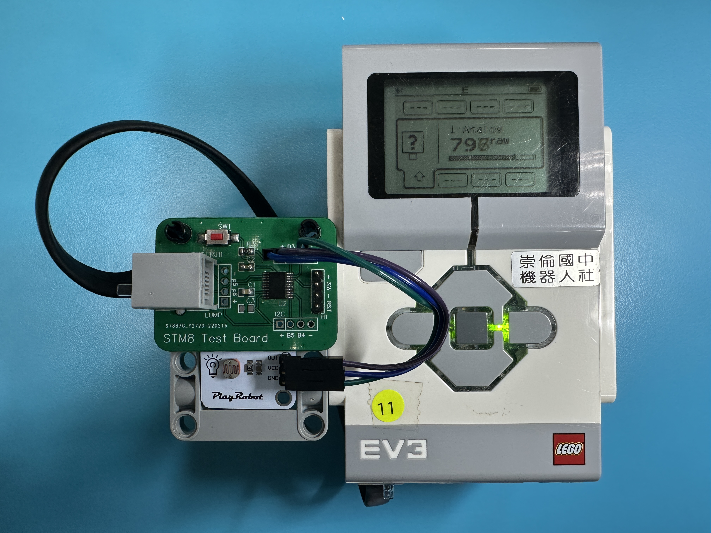|

⚠️ Supported sensors include, but are not limited to, the sensors mentioned above.
<!--⚠️ 支援的感測器包括但不限於上述提到的感測器。--->

## Functional descriptions
### EV3 Port View
In the EV3 port view, the following three modes are available:
<!--在EV3 Port View中有以下三種模式：--->

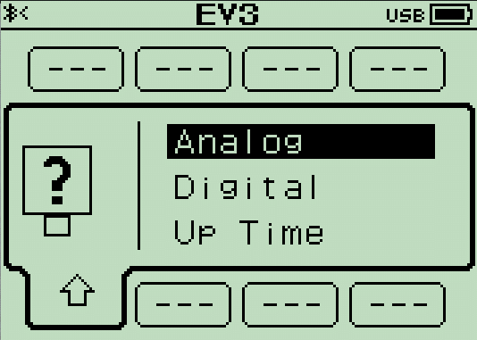

| Analog | Digital | Up time (Debug) |
|:-------:|:-------:|:------:|
|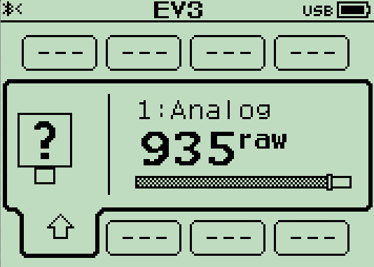|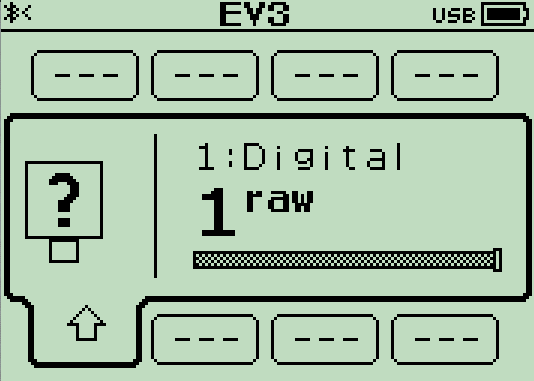|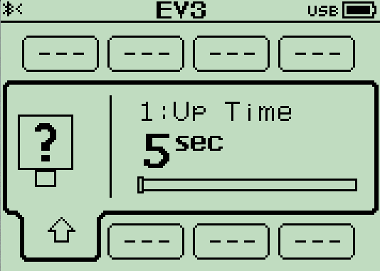|

### EV3-G Block
Using the specialized block, you can retrieve the value of the sensor connected to the adapter. There are two modes available for the block:
<!--使用專屬的Block，你可以獲取連接在adapter上的感測器的數值。Block有以下兩種模式：--->

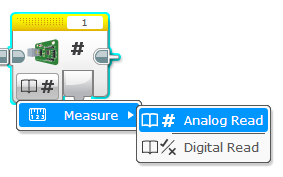

| Analog Read | Digital Read |
:-------:|:-------:|
||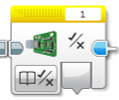|

<!--
## Build your own Adapter
### Preparation
### Flashing the firmware
### Wiring
--->

## Contributors

- HsiangYi Tsai, [devilhyt](https://github.com/devilhyt) on Github (Author)
- Anthony Hsu, [a10036gt](https://github.com/a10036gt) on Github (PCB Design / Technical Support)

<!--
## References
[LEGO® Robotics Firmware Documentation](http://ev3.fantastic.computer/doxygen/index.html)  
[LEGO® EV3 Developer Kits](https://education.lego.com/en-us/product-resources/mindstorms-ev3/downloads/developer-kits)  
[ST RM0016](https://www.st.com/resource/en/reference_manual/rm0016-stm8s-series-and-stm8af-series-8bit-microcontrollers-stmicroelectronics.pdf)  
[ST DS6120](https://www.st.com/resource/en/datasheet/stm8s103f3.pdf) 
--->  

